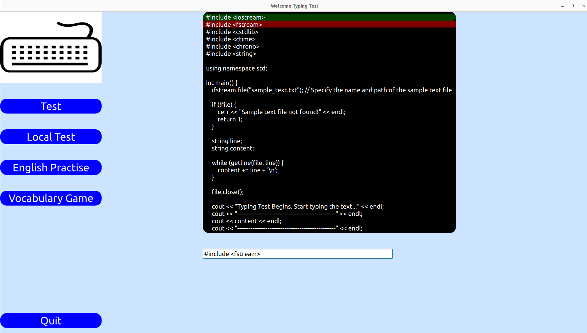
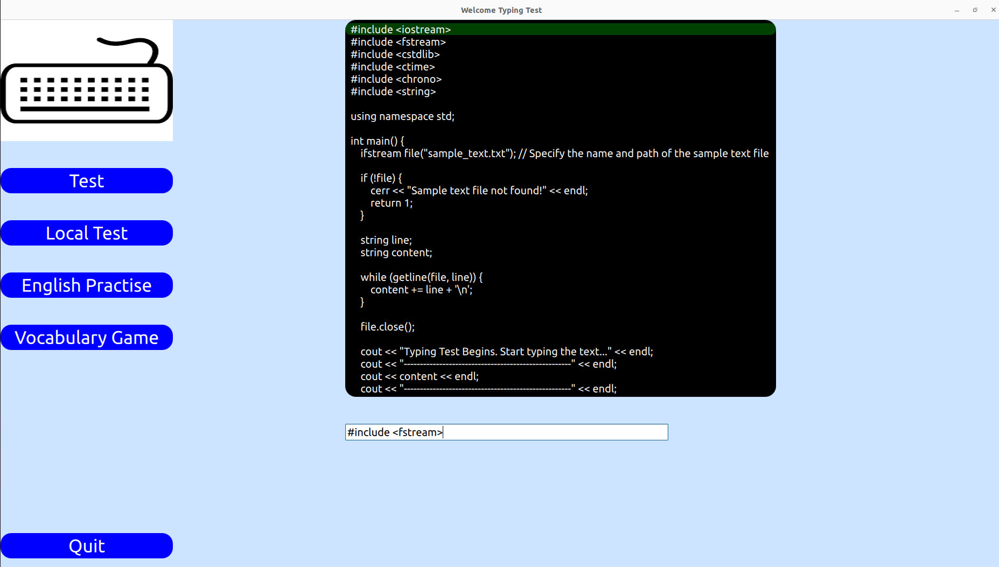

# SyntacticTypingTest
SyntacticTypingTest is a comprehensive platform designed to enhance your coding skills by combining code syntax review with typing practice. This interactive tool provides programmers, both beginners and experienced, with an engaging environment to refresh their coding knowledge and typing accuracy.

<div align="center">
    
    
</div>

# Features

- Test
- LocalTest
- English Practise
- Vocabulary Game

### Dependencies
- Qt >= 5.9
  + Development tools
- GCC >= 7.4
- CMake >= 3.13

### Installation

Pen can be installed on Linux, Microsoft Windows, and macOS.

1. Clone the repo
   ```sh
   git clone https://github.com/Canytr/SyntacticTypingTest.git
   ```

### Built With CMake

This project leverages the power of Qt, a comprehensive cross-platform C++ framework, to provide a rich and intuitive user interface for effective code reviews. Additionally, CMake orchestrates the build process, ensuring seamless integration and ease of compilation.

CMake reads the CMakeLists.txt file and creates makefiles from it. This means that after we run CMake, we need to run make to actually build our project. We'll do this from a separate directory so the binaries don't clutter up our source directory.

```shell
mkdir build
cd build
cmake ..
make
```

<!-- CONTRIBUTING -->
### Contributing

If you have a suggestion that would make this better, please fork the repo and create a pull request. You can also simply open an issue with the tag "enhancement".

1. Fork the Project
2. Create your Feature Branch (`git checkout -b feature/AmazingFeature`)
3. Commit your Changes (`git commit -m 'Add some AmazingFeature'`)
4. Push to the Branch (`git push origin feature/AmazingFeature`)
5. Open a Pull Request


<!-- LICENSE -->
### License

Distributed under the MIT License. See [MIT](LICENSE) for more information.

